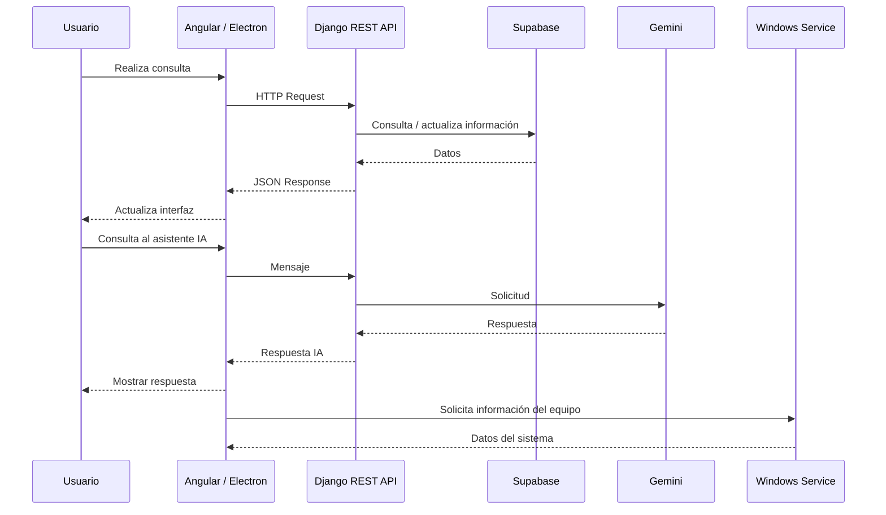

# Help Desk & Smart Inventory — Frontend

Aplicación cliente de la plataforma **Help Desk & Smart Inventory**, desarrollada con **Angular** y **TypeScript**.

El proyecto proporciona la interfaz de usuario para la gestión de tickets, inventario tecnológico, dispositivos y asistencia mediante inteligencia artificial.

Además de la versión web, el proyecto incorpora una aplicación de escritorio mediante **Electron** y un **Windows Service desarrollado con Node.js**, permitiendo integrar funcionalidades específicas del entorno Windows y recopilar información del equipo donde se encuentra instalada la aplicación.

---

## Descripción

El frontend funciona como capa de interacción entre los usuarios y la API REST desarrollada en Django.

La aplicación permite centralizar diferentes procesos relacionados con soporte técnico e inventario:

* Gestión de tickets.
* Consulta y administración de incidencias.
* Visualización del inventario.
* Gestión de dispositivos.
* Chat de soporte asistido por IA.
* Administración de usuarios.
* Visualización de información del equipo.
* Comunicación con el backend.
* Ejecución como aplicación de escritorio.
* Comunicación con un servicio local de Windows.

---

## Características principales

### Help Desk

Interfaz para gestionar las solicitudes de soporte:

* Creación de tickets.
* Consulta de tickets.
* Actualización de estados.
* Priorización.
* Clasificación.
* Seguimiento.
* Visualización del historial.

---

### Inventario

La aplicación permite consultar y administrar información relacionada con los activos tecnológicos:

Inventario
│
├── Equipos
├── Hardware
├── Software
├── Usuarios
└── Estado del dispositivo

La información puede ser obtenida desde la API y, en el caso de la aplicación de escritorio, complementada mediante información proporcionada por el Windows Service.

---

### Chat de soporte con IA

El frontend incorpora una interfaz conversacional para interactuar con el asistente de soporte.

┌──────────────┐
│    Usuario   │
└──────┬───────┘
       │
       ▼
┌──────────────┐
│ Angular Chat │
└──────┬───────┘
       │
       │ HTTP
       ▼
┌──────────────┐
│ Django API   │
└──────┬───────┘
       │
       ▼
┌──────────────┐
│ Gemini API   │
└──────────────┘

La aplicación cliente no maneja directamente las credenciales de Gemini. La comunicación con el servicio de IA se realiza a través del backend.

---

# Arquitectura

El frontend forma parte de un ecosistema compuesto por varios componentes:

    [Angular Frontend Frontend] - [Electron Desktop App] ────► [Windows Service] 
                            │                                          ├
                            ├──────────────────────────────────────────├                                       
                            ▼                                          
                      [HTTP / REST]                                    
                            │                                           
                            ▼
                    [Django REST API] ────► [Gemini API]
                            │
                            ▼ 
                 [PostgreSQL / Supabase] 

### Arquitectura de escritorio

Cuando la aplicación se ejecuta como aplicación de escritorio, Electron actúa como contenedor de la aplicación Angular.

┌──────────────────────────────────────┐
│            Electron                  │
│                                      │
│  ┌────────────────────────────────┐  │
│  │          Angular UI            │  │
│  │                                │  │
│  │  Dashboard                     │  │
│  │  Help Desk                     │  │
│  │  Inventory                     │  │
│  │  AI Assistant                  │  │
│  └───────────────┬────────────────┘  │
│                  │                   │
└──────────────────┼───────────────────┘
                   │
                   ▼
        Node.js Windows Service
                   │
                   ▼
        Windows Operating System

---

# Stack tecnológico

| Tecnología | Uso                        |
| ---------- | -------------------------- |
| Angular    | Framework frontend         |
| TypeScript | Lenguaje principal         |
| RxJS       | Programación reactiva      |
| HTML / CSS | Interfaz                   |
| Electron   | Aplicación de escritorio   |
| Node.js    | Windows Service            |
| REST API   | Comunicación con backend   |
| JSON       | Intercambio de información |
| Git        | Control de versiones       |

---

# Estructura del proyecto

UAS_Help_Desk_Frontend/
│
├── Help_Desk_Frontend/
│   ├── src/
│   │   ├── app/
│   │   │   ├── core/
│   │   │   │   ├── components/
│   │   │   │   │   ├── loading-overlay/
│   │   │   │   │
│   │   │   │   ├── configs/
│   │   │   │   │   ├── chart.config.ts
│   │   │   │   │
│   │   │   │   ├── guards/
│   │   │   │   │   ├── admin.guard.ts
│   │   │   │   │   ├── auth.guard.ts
│   │   │   │   │   ├── client.guard.ts
│   │   │   │   │   ├── landing.guard.ts
│   │   │   │   │   ├── technician.guard.ts
│   │   │   │   │   
│   │   │   │   ├── interceptors/
│   │   │   │   │   ├── auth.interceptor.ts
│   │   │   │   │   ├── loading.interceptor.ts
│   │   │   │   │   
│   │   │   │   ├── models/
│   │   │   │   │   ├── asset.model.ts
│   │   │   │   │   ├── ai_support.model.ts
│   │   │   │   │   ├── ticket.model.ts
│   │   │   │   │   ├── user.model.ts
│   │   │   │   │   
│   │   │   │   ├── services/
│   │   │   │   │   ├── admin.service.ts
│   │   │   │   │   ├── ai_support.service.ts
│   │   │   │   │   ├── asset.service.ts
│   │   │   │   │   ├── auth.service.ts
│   │   │   │   │   ├── loading.service.ts
│   │   │   │   │   ├── report.service.ts
│   │   │   │   │   ├── theme.service.ts
│   │   │   │   │   ├── ticket.service.ts
│   │   │   │   │   
│   │   │   ├── environments/
│   │   │   │   ├── environment.ts
│   │   │   │   │
│   │   │   ├── features/
│   │   │   │   ├── admin/
│   │   │   │   │   ├── assets/
│   │   │   │   │   ├── dashboard/
│   │   │   │   │   ├── departments/
│   │   │   │   │   ├── reports/
│   │   │   │   │   ├── tickets/
│   │   │   │   │   ├── users/
│   │   │   │   │   ├── admin.routes.ts
│   │   │   │   │   
│   │   │   │   ├── auth/
│   │   │   │   │   ├── activate-account/
│   │   │   │   │   ├── change-password/
│   │   │   │   │   ├── forgot-paasword/
│   │   │   │   │   ├── login/
│   │   │   │   │   ├── register/
│   │   │   │   │   ├── reset-password/
│   │   │   │   │   ├── login.routes.ts
│   │   │   │   │   
│   │   │   │   ├── client/
│   │   │   │   │   ├── ai_history/
│   │   │   │   │   ├── ai_support/
│   │   │   │   │   ├── dashboard/
│   │   │   │   │   ├── tickets/
│   │   │   │   │   ├── login.routes.ts
│   │   │   │   │   
│   │   │   │   ├── landing/
│   │   │   │   │   ├── landing/
│   │   │   │   │   ├── landing.routes.ts
│   │   │   │   │   
│   │   │   │   │   
│   │   │   │   ├── technician/
│   │   │   │   │   ├── dashboard/
│   │   │   │   │   ├── tickets/
│   │   │   │   │   ├── technician.routes.ts
│   │   │   │   │
│   │   │   ├── shared/
│   │   │   │   ├── admin-layout/
│   │   │   │   ├── client-layout/
│   │   │   │   ├── technician-layout/
│   │   │   │   
│   │   │   ├── app.config.ts
│   │   │   ├── app.css
│   │   │   ├── app.html
│   │   │   ├── app.routes.ts
│   │   │   ├── app.spec.ts
│   │   │   ├── app.ts
│   │   │
│   │   ├── index.html
│   │   ├── main.ts
│   │   ├── styles.css
│   │ 
│   ├── public/
│   │   ├──img/
│   ├── .editorconfig
│   ├── .gitignore
│   ├── angular.json
│   ├── package.json
│   ├── tsconfig.json
│   ├── tsconfig.app.json
│
├── angular.json
├── package.json
├── tsconfig.json
├── .env.example
└── README.md

La estructura está separada por responsabilidades para facilitar el mantenimiento y permitir reutilizar componentes entre la aplicación web y la aplicación de escritorio.

---

# Comunicación con el Backend

Angular consume los endpoints REST proporcionados por Django.

```text
Angular
   │
   │ HttpClient
   ▼
REST API
   │
   ▼
Django
```

Ejemplo conceptual:

```typescript
this.http.get('/api/tickets/');
```

Los servicios de Angular encapsulan las operaciones relacionadas con cada dominio, por ejemplo:

TicketService
InventoryService
DeviceService
AuthService
AiAssistantService
UserService

Esto permite mantener separada la lógica de presentación de la comunicación con la API.

---

# Autenticación

La aplicación utiliza el mecanismo de autenticación proporcionado por el backend.

El flujo general es:

Login
  │
  ▼
Angular
  │
  │ Credentials
  ▼
Django API
  │
  │ Authentication Token
  ▼
Angular
  │
  ▼
Protected Routes

Las rutas protegidas se gestionan mediante guards y los servicios correspondientes.

---

# Aplicación de escritorio

La aplicación web puede empaquetarse como aplicación de escritorio utilizando **Electron**.

Electron permite ejecutar la aplicación Angular dentro de un entorno de escritorio y proporcionar funcionalidades adicionales que no están disponibles directamente desde un navegador.

### Flujo

Angular
   │
   ▼
Electron
   │
   ├── Aplicación de escritorio
   │
   └── Comunicación con Windows Service

---

#  Windows Service

La solución incluye un servicio desarrollado con **Node.js** que se instala junto con la aplicación de escritorio.

El objetivo del servicio es proporcionar una capa de comunicación con el sistema operativo Windows y realizar tareas que requieren ejecución en segundo plano.

Ejemplos de responsabilidades:

* Obtención de información del equipo.
* Recolección de datos de hardware.
* Consulta de información del sistema.
* Sincronización de información con la aplicación.
* Comunicación local con Electron.

Arquitectura:

┌─────────────────────┐
│   Electron App      │
│                     │
│      Angular        │
└──────────┬──────────┘
           │
           │ IPC / Local Communication
           ▼
┌─────────────────────┐
│ Node.js Windows     │
│ Service             │
└──────────┬──────────┘
           │
           ▼
┌─────────────────────┐
│ Windows SO          │
│                     │
└─────────────────────┘

---

# Instalación

## Requisitos

* Node.js
* npm
* Angular CLI
* Git
* Windows, para las funcionalidades relacionadas con Electron y Windows Service.

Instalar Angular CLI:

```bash
npm install -g @angular/cli
```

Clonar el repositorio:

```bash
git clone https://github.com/JuliusGarcia28/UAS_Help_Desk-FrontEnd

cd UAS_Help_Desk-Frontend
```

Instalar dependencias:

```bash
npm install
```

---

# Desarrollo

Ejecutar la aplicación Angular:

```bash
ng serve
```

La aplicación estará disponible normalmente en:

```
http://localhost:4200/
```

---

# Ejecutar Electron

Después de iniciar el entorno Angular:

```bash
npm run electron
```

> El comando exacto puede variar dependiendo de la configuración del proyecto.

---

# Build

Generar una versión de producción:

```bash
ng build
```

Los archivos generados estarán disponibles dentro del directorio:

```text
dist/
```

---

# Build de escritorio

La aplicación puede ser empaquetada utilizando la configuración de Electron.

Ejemplo:

```bash
npm run electron:build
```

El instalador generado puede distribuirse para su instalación en equipos Windows.

> Sustituir este comando por el utilizado realmente por el proyecto, por ejemplo Electron Builder o Electron Forge.

---

# Instalación del Windows Service

El servicio de windows hecho con Node.js se instala junto con la aplicación de escritorio.

El proceso conceptual es:

Instalador
   │
   ├── Instala Electron Application
   │
   └── Instala Windows Service
            │
            ▼
       Windows Service Manager

Una vez instalado, el servicio puede ejecutarse en segundo plano independientemente de la interfaz gráfica.

---

# Configuración

Las configuraciones específicas del ambiente deben almacenarse fuera del código fuente.

Ejemplo:

```env
API_URL=http://localhost:8000/api

ENVIRONMENT=development
```

Para producción:

```env
API_URL=https://api.example.com/api

ENVIRONMENT=production
```

No almacenar credenciales o secretos directamente en el repositorio.

---

# Integración completa

El ecosistema completo funciona de la siguiente manera:



---

# Principios de desarrollo

El frontend busca mantener una arquitectura organizada y escalable mediante:

* Separación de responsabilidades.
* Componentización.
* Servicios reutilizables.
* Guards para rutas protegidas.
* Interceptores HTTP.
* Programación reactiva mediante RxJS.
* Separación entre presentación y acceso a datos.
* Configuración independiente por ambiente.
* Reutilización entre entorno web y escritorio.

# Autor

**[Julian Javier Garcia Alvarez]**

Desarrollador de software enfocado en aplicaciones web, aplicaciones de escritorio, APIs, automatización e integración de soluciones.

---